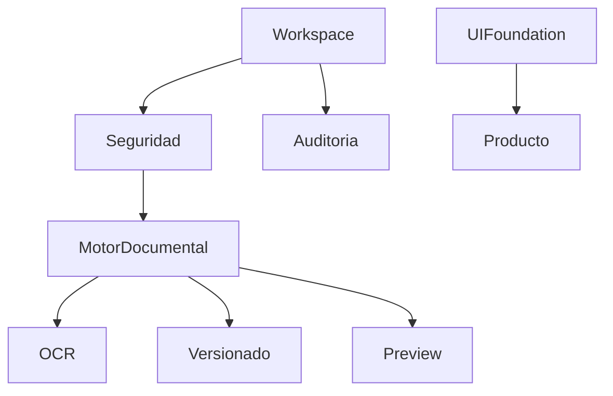

# Capacidades Compartidas

**Estado:** Aprobado  
**Responsable:** Arquitectura de Plataforma  

---

## Objetivo

Documentar las capacidades reutilizables que sostienen Documental Platform.

---

## Mapa de capacidades

---

## Capacidades

### Workspace

Contexto oficial de trabajo.

### Seguridad

JWT, permisos, session context y validación de empresa.

### Motor Documental

Documento lógico, archivo físico, versiones, OCR y clave documental.

### Auditoría

Registro transversal de acciones.

### UI Foundation

Base visual y funcional para todos los módulos.

---

## Regla

Toda capacidad compartida debe ser reutilizable por futuros sistemas.

---

## Ver también

- `../01-plataforma/02-capacidades-compartidas.md`
- `../11-adr/ADR-009-arquitectura-por-capacidades-compartidas.md`
