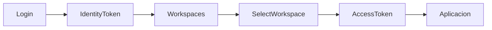

# Workspace

**Estado:** Aprobado  
**Responsable:** Arquitectura de Seguridad  

---

## Definición

Workspace representa el contexto completo de trabajo.

```text
Workspace = Usuario + Empresa + Sistema + Perfil
```

---

## Por qué existe

Empresa Activa no era suficiente porque un usuario puede tener varios perfiles en una misma empresa.

Ejemplo:

```text
BBTI · Finanzas
BBTI · Contabilidad
```

Son contextos diferentes.

---

## Flujo



---

## JWT contextual

El token final debe incluir:

- workspaceId
- empresa
- clienteDestinoId
- sistema
- perfil
- permisos
- sessionContextId
- permissionVersion

---

## Regla

El backend nunca debe usar empresa enviada por frontend como fuente oficial.

---

## Ver también

- `../08-seguridad/01-workspace.md`
- `../08-seguridad/02-jwt.md`
- `../11-adr/ADR-001-workspace.md`
