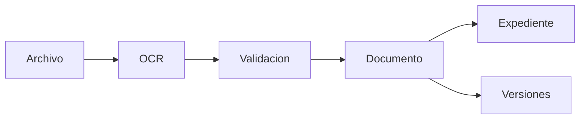

# Motor Documental

**Estado:** Aprobado  
**Responsable:** Maestro Sucesor I  

---

## Objetivo

El Motor Documental es la capacidad compartida encargada de transformar archivos en documentos de negocio.

---

## Conceptos

### Documento lógico

Entidad de negocio.

Ejemplos:

- Factura
- OC
- OS
- Guía
- Nota de ingreso
- Transferencia
- Detracción

### Archivo físico

Evidencia asociada a un documento lógico.

Ejemplos:

- PDF original
- PDF firmado
- escaneo
- imagen
- sustento

---

## Flujo

---

## Reglas

- Backend calcula clave documental.
- OCR propone, backend confirma.
- Nunca sobrescribir archivos.
- Duplicados generan propuesta de versión.
- Revisión Contable trabaja sobre documentos lógicos.

---

## Ver también

- `../motor-documental/README.md`
- `../11-adr/ADR-002-documento-logico.md`
- `../11-adr/ADR-006-estrategia-de-versionado-documental.md`
