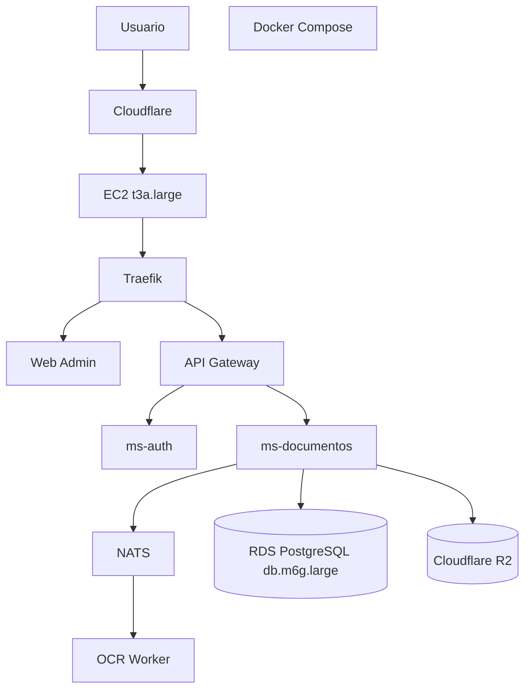

# Deployment AWS

```mermaid
flowchart TD
    User[Usuario]
    CF[Cloudflare]
    EC2[EC2 t3a.large]
    Traefik[Traefik]
    Docker[Docker Compose]
    Web[Web Admin]
    Gateway[API Gateway]
    Auth[ms-auth]
    Docs[ms-documentos]
    OCR[OCR Worker]
    NATS[NATS]
    RDS[(RDS PostgreSQL db.m6g.large)]
    R2[(Cloudflare R2)]

    User --> CF
    CF --> EC2
    EC2 --> Traefik
    Traefik --> Web
    Traefik --> Gateway
    Gateway --> Auth
    Gateway --> Docs
    Docs --> NATS
    NATS --> OCR
    Docs --> RDS
    Docs --> R2
```

## Referencias

- `../07-infraestructura/01-despliegue.md`
- `../29-operations-manual/11-deployment-readiness-checklist.md`
