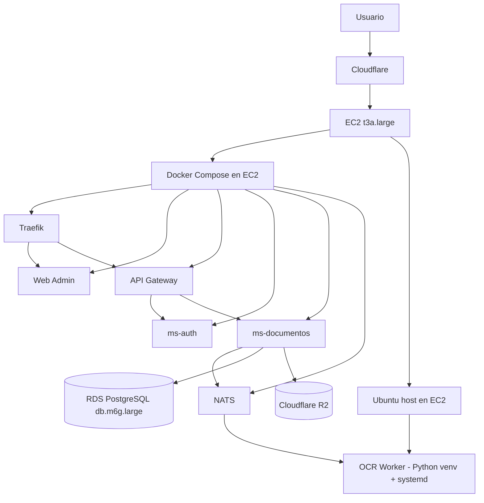

# Deployment AWS

## Referencias

- `../07-infraestructura/01-despliegue.md`
- `../07-infraestructura/02-docker.md`
- `../07-infraestructura/05-ocr-worker.md`
- `../18-runbooks/ocr-worker-host.md`
- `../29-operations-manual/11-deployment-readiness-checklist.md`
