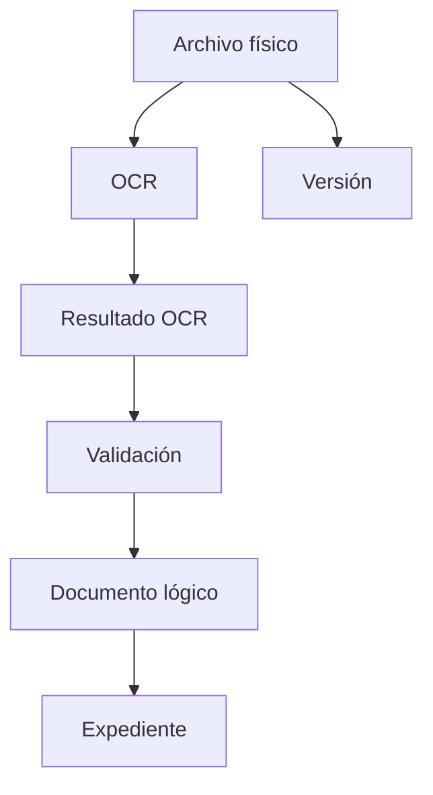

# Motor Documental Flow

```mermaid
flowchart TD
    Archivo[Archivo físico]
    OCR[OCR]
    Resultado[Resultado OCR]
    Validacion[Validación]
    Documento[Documento lógico]
    Version[Versión]
    Expediente[Expediente]

    Archivo --> OCR
    OCR --> Resultado
    Resultado --> Validacion
    Validacion --> Documento
    Archivo --> Version
    Documento --> Expediente
```

## Referencias

- `../motor-documental/Motor-Documental-Architecture.md`
- `../11-adr/ADR-002-documento-logico.md`
- `../11-adr/ADR-003-versionado.md`
