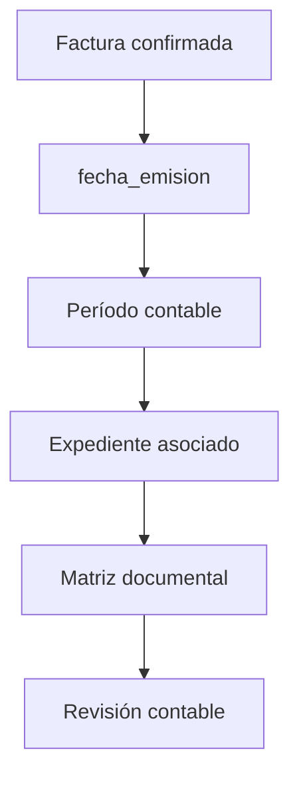

# Revisión Contable Flow

## Regla

Revisión Contable nace desde facturas confirmadas por período, no desde expedientes sin factura.

## Referencias

- `../11-adr/ADR-004-factura-periodo.md`
- `../17-domain/revision-contable.md`
- `../16-api/revision-contable.md`
