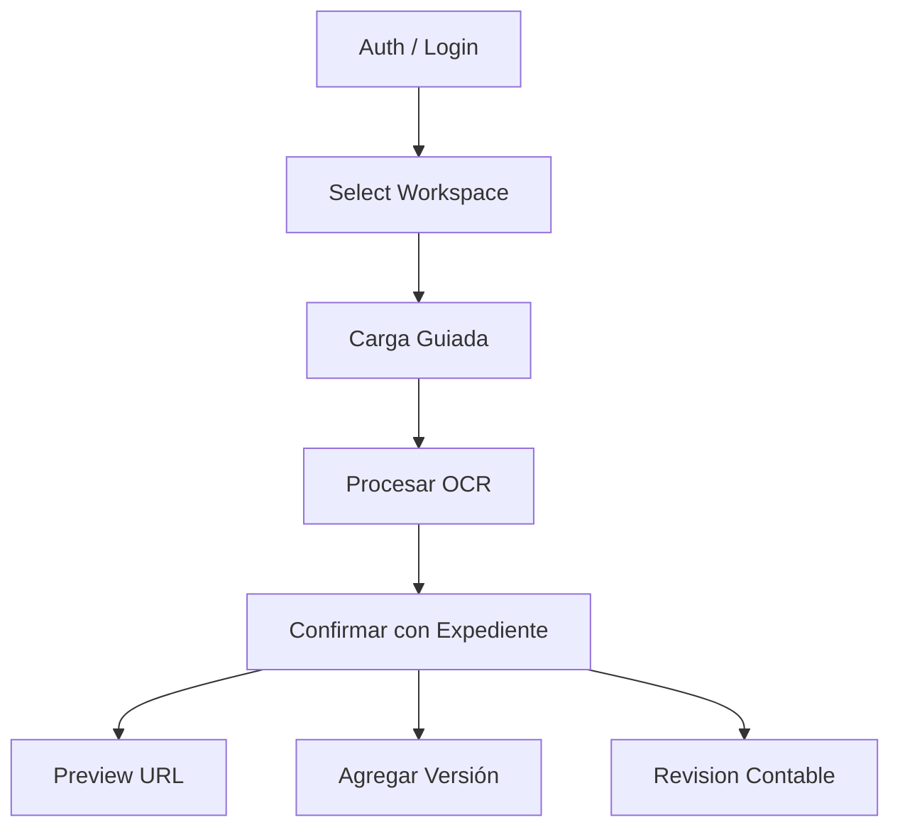

# API Map

## Endpoints relacionados

- `16-api/auth.md`
- `16-api/carga-guiada.md`
- `16-api/procesar-ocr.md`
- `16-api/confirmar-con-expediente.md`
- `16-api/preview-url.md`
- `16-api/versionado.md`
- `16-api/revision-contable.md`
