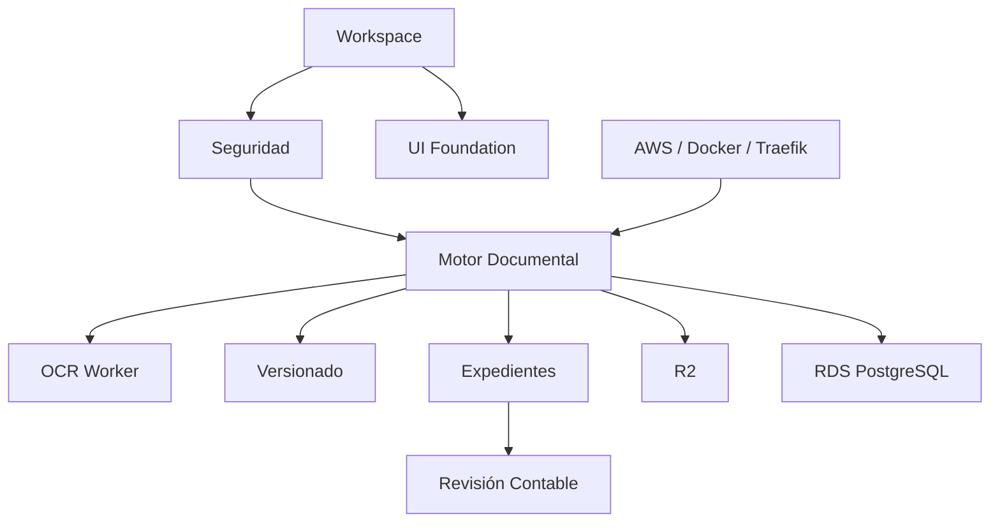

# Architecture Map

```mermaid
flowchart TD
    Workspace[Workspace]
    Security[Seguridad]
    Motor[Motor Documental]
    OCR[OCR Worker]
    Versionado[Versionado]
    Expedientes[Expedientes]
    Revision[Revisión Contable]
    UI[UI Foundation]
    Infra[AWS / Docker / Traefik]
    Storage[R2]
    DB[RDS PostgreSQL]

    Workspace --> Security
    Workspace --> UI
    Security --> Motor
    Motor --> OCR
    Motor --> Versionado
    Motor --> Expedientes
    Expedientes --> Revision
    Motor --> Storage
    Motor --> DB
    Infra --> Motor
```

## Referencias

- `02-arquitectura/01-arquitectura-general.md`
- `architecture/C2-Containers.md`
- `architecture/Deployment-AWS.md`
