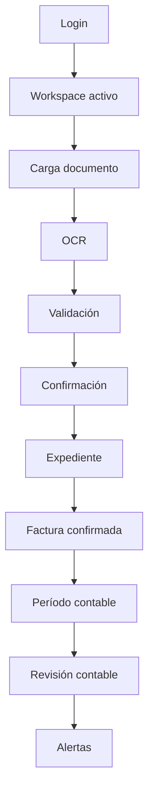

# Business Map

```mermaid
flowchart TD
    Login[Login]
    WS[Workspace activo]
    Carga[Carga documento]
    OCR[OCR]
    Validacion[Validación]
    Confirmacion[Confirmación]
    Expediente[Expediente]
    Factura[Factura confirmada]
    Periodo[Período contable]
    Revision[Revisión contable]
    Alertas[Alertas]

    Login --> WS
    WS --> Carga
    Carga --> OCR
    OCR --> Validacion
    Validacion --> Confirmacion
    Confirmacion --> Expediente
    Expediente --> Factura
    Factura --> Periodo
    Periodo --> Revision
    Revision --> Alertas
```
