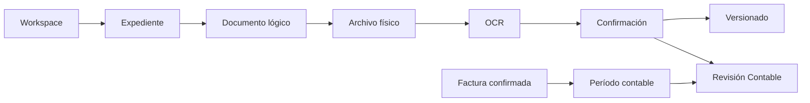

# Domain Map

```mermaid
flowchart LR
    Workspace --> Expediente
    Expediente --> DocumentoLogico[Documento lógico]
    DocumentoLogico --> ArchivoFisico[Archivo físico]
    ArchivoFisico --> OCR
    OCR --> Confirmacion[Confirmación]
    Confirmacion --> Versionado
    Confirmacion --> RevisionContable[Revisión Contable]
    Factura[Factura confirmada] --> Periodo[Período contable]
    Periodo --> RevisionContable
```

## Regla clave

La Revisión Contable nace desde facturas confirmadas por período y agrupa por expediente.
