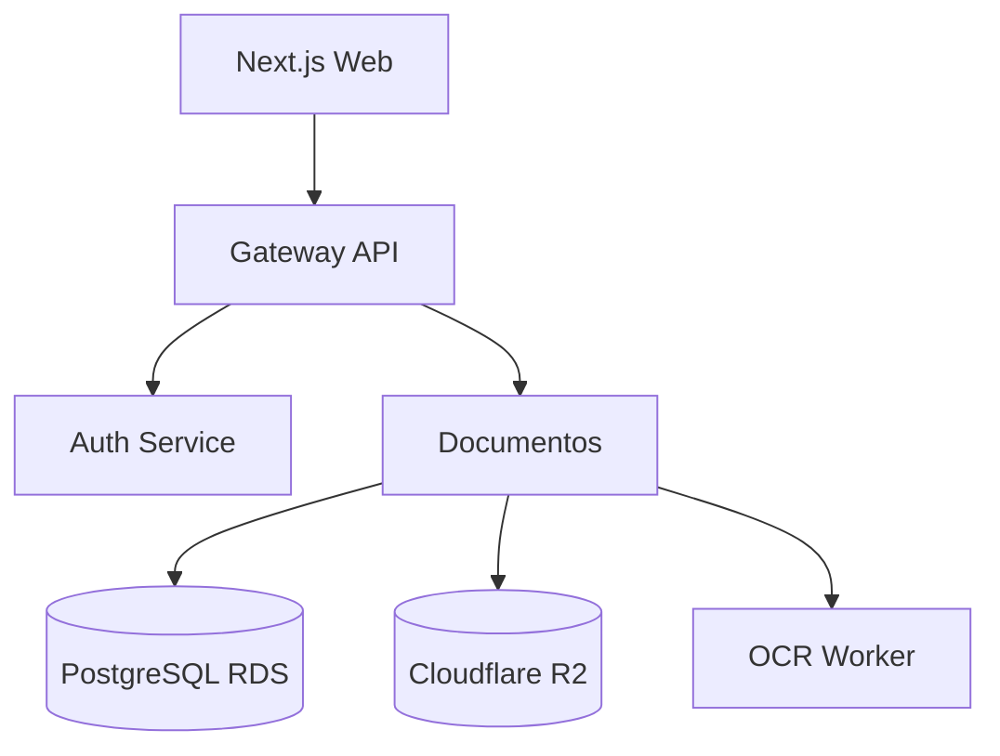

# C2 - Containers

```mermaid
flowchart TB
WEB[Next.js Web]
GW[Gateway API]
AUTH[Auth Service]
DOC[Documentos]
OCR[OCR Worker]
RDS[(PostgreSQL RDS)]
R2[(Cloudflare R2)]

WEB-->GW
GW-->AUTH
GW-->DOC
DOC-->RDS
DOC-->R2
DOC-->OCR
```
